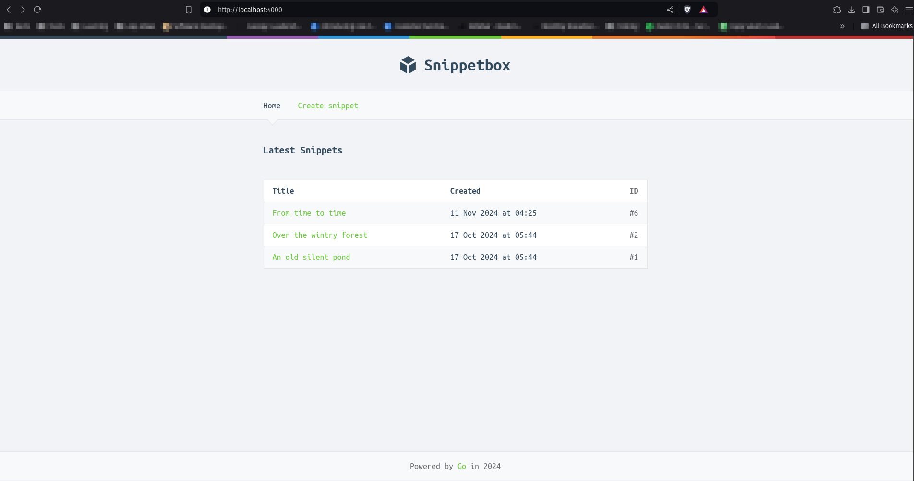
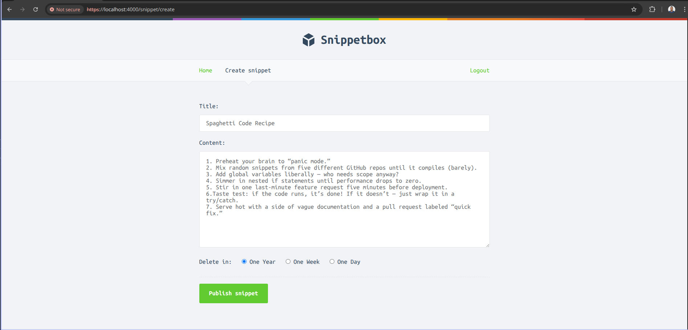
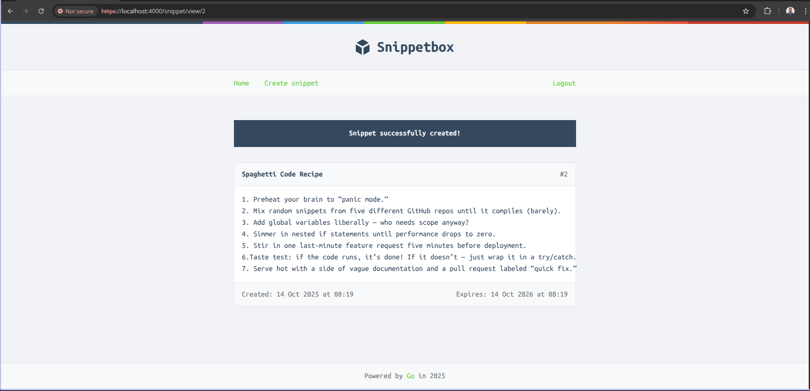
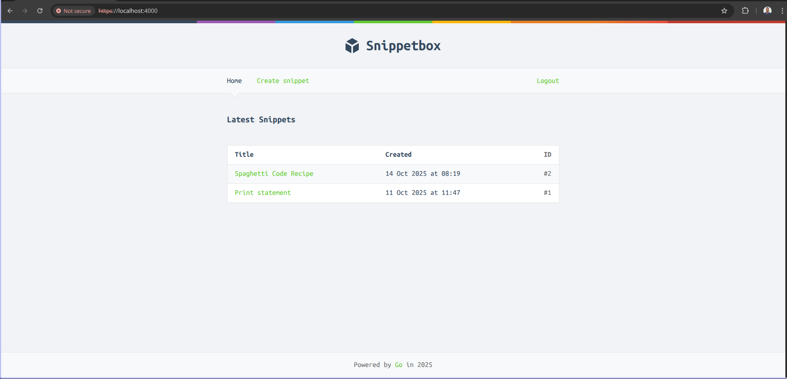

# Snippets app





## Description

This is a simple snippets app that allows you to store text snippets.

## Stack

- Mux (Router)
- Go SQL Driver (Database)
- Alice (Middleware)
- NoSurf (CSRF protection)


## How to run

1. Clone the repository

```bash
git clone https://github.com/takumade/snippets
```

2. Change directory

```bash
cd snippets
```


3. Database setup

**Create database:**

```sql
CREATE DATABASE snippetbox;
CREATE USER 'web'@'localhost' WITH PASSWORD 'pass';
GRANT ALL PRIVILEGES ON snippetbox.* TO 'web'@'localhost';
FLUSH PRIVILEGES;
```

**Create tables:**

`internal/db/users.sql`
`internal/db/snippets.sql`
`internal/db/sessions.sql`


4. Install dependencies

```bash
go mod tidy
```

5. Install certs

```bash
mkdir tls && cd tls && go run /usr/local/go/src/crypto/tls/generate_cert.go --rsa-bits=2048 --host=localhost
```

6. Run the server

```bash
go run ./cmd/web
```

7. Open your browser and navigate to `http://localhost:4000`

